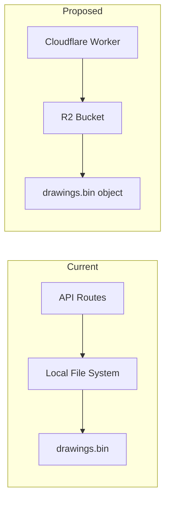
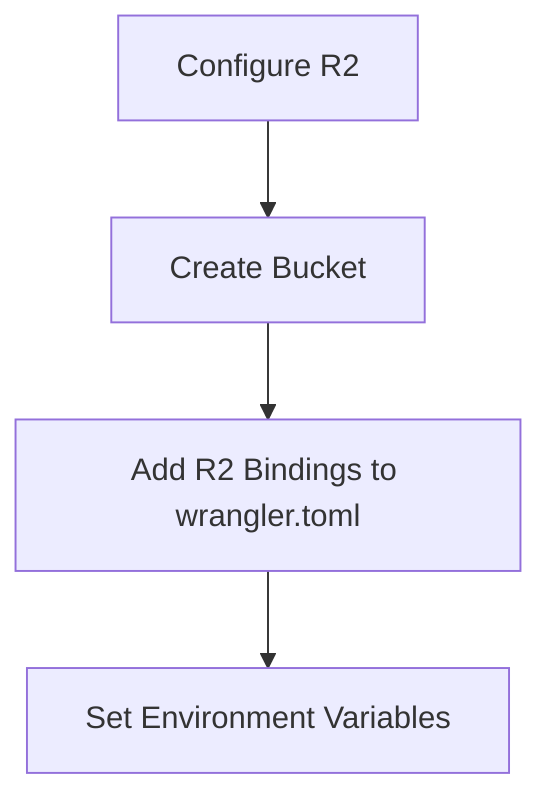
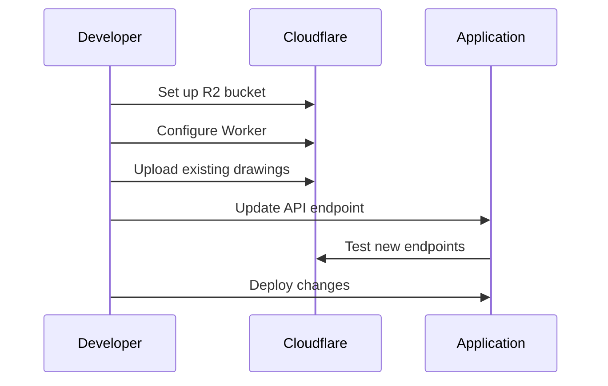

# Guestbook API Migration Plan: File System to Cloudflare R2

This document outlines the plan for migrating the guestbook API from local file system storage to Cloudflare R2.

## Architecture Changes

### Current vs Proposed Architecture



## Implementation Plan

### 1. R2 Storage Setup



### 2. API Endpoint Migration

The core logic will remain similar, but file operations will be replaced with R2 operations:

```typescript
export interface Env {
  DRAWINGS: R2Bucket;
  GUESTBOOK_SECRET_KEY: string;
}

// GET - Read all drawings
export const onRequestGet: PagesFunction<Env> = async ({ env }) => {
  try {
    const obj = await env.DRAWINGS.get('drawings.bin');
    const content = obj ? await obj.arrayBuffer() : new ArrayBuffer(0);

    return new Response(content, {
      headers: {
        'Content-Type': 'application/octet-stream',
        'Access-Control-Allow-Origin': '*',
      },
    });
  } catch (e) {
    return new Response('Error retrieving drawings', { status: 500 });
  }
};

// POST - Append new drawing
export const onRequestPost: PagesFunction<Env> = async ({ request, env }) => {
  try {
    const buffer = new Uint8Array(await request.arrayBuffer());
    const delimiter = new Uint8Array([255]);

    // Get existing data
    const existing = await env.DRAWINGS.get('drawings.bin');
    const existingData = existing ? new Uint8Array(await existing.arrayBuffer()) : new Uint8Array(0);

    // Concatenate existing data + delimiter + new drawing
    const newData = new Uint8Array([...existingData, ...delimiter, ...buffer]);

    await env.DRAWINGS.put('drawings.bin', newData);
    return new Response('Drawing received', { status: 200 });
  } catch (e) {
    return new Response('Error saving drawing', { status: 500 });
  }
};
```

### 3. Configuration Requirements

```toml
# wrangler.toml
[[r2_buckets]]
binding = 'DRAWINGS'
bucket_name = 'guestbook-drawings'
preview_bucket_name = 'guestbook-drawings-dev'

[vars]
GUESTBOOK_SECRET_KEY = "" # Set in Cloudflare dashboard
```

### 4. Migration Strategy



#### Migration Steps:

1. Create R2 bucket in Cloudflare
2. Set up Worker with R2 bindings
3. Migrate existing drawings.bin data to R2
4. Deploy Worker
5. Update frontend API endpoint URL
6. Test thoroughly
7. Switch traffic to new endpoint

## Technical Considerations

### 1. Data Consistency

- Single R2 object maintains atomic operations
- Delimiter-based structure preserved (0xFF byte)
- Binary data handling remains unchanged

### 2. Performance

- R2 operations are atomic but may have higher latency
- Need to handle the entire binary blob for updates
- Consider implementing chunking for large datasets

### 3. Error Handling

- Add R2-specific error cases
- Maintain consistent error response format for API compatibility
- Proper handling of R2 operation failures

## Testing Requirements

1. **Functional Testing**

   - Verify drawing uploads work correctly
   - Confirm drawing retrieval matches current behavior
   - Test deletion functionality
   - Validate delimiter handling

2. **Performance Testing**

   - Measure latency for drawing operations
   - Test with varying payload sizes
   - Verify concurrent operation handling

3. **Error Handling**
   - Test R2 connection failures
   - Verify error responses match current format
   - Test invalid request handling

## Rollback Plan

1. Maintain backup of drawings.bin
2. Keep old API endpoint code
3. Document rollback procedure:
   - Restore drawings.bin from backup
   - Revert API endpoint changes
   - Update frontend to original endpoint
